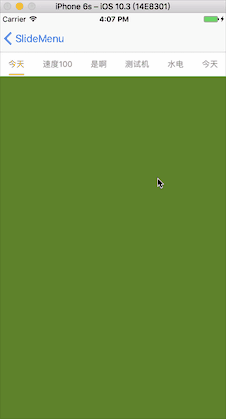

##### CKSlideMenu 介绍

------

> 2017.8.21
>
> 最近把这个滚动导航做了一次优化，想做到更多的使用场景。
>
> 添加了固定模式、下标及title细节的自定义。
>
> 具体使用见下文或者demo

​	**支持cocoapod** : `pod 'CKSlideMenu'`

​	闲来无事，看到半塘的滚动菜单的动画还是蛮有意思的。所以写了这个一个东西，效果如下(效果图可能没有更新，可以具体看demo)：


    		


> ~~当数组元素个数较少时，会固定顶部的滚动视图，重新布局位置~~

改为用户控制是否固定顶部的滚动视图，这样似乎更加人性化。

```swift
/// 是否是固定型菜单（不需要修正滚动）
    var isFixed:Bool = false
```

   


###### 1.主要属性

```swift
    //MARK: - 成员变量
    /// 是否是固定型菜单（不需要修正滚动）
    var isFixed:Bool 				= false
    
    /// 是否懒加载子控制器 (有些用户想要滚动到对应视图才执行加载动作，所以添加了这个属性)
    var lazyLoad:Bool 				= true
    
    /// 选中颜色 (在不设置下标颜色的时候，会此为下标的颜色)
    var selectedColor:UIColor       = UIColor.red
    
    /// 未选中颜色
    var unSelectedColor:UIColor     = UIColor.black
    
    /// 下标宽度 (在titleStyle 为normal时有效)
    var indicatorWidth:CGFloat      = 30 
    
    /// 下标高度
    var indicatorHeight:CGFloat     = 2 
    
    /// 下标距离底部距离
    var bottomPadding:CGFloat       = 0
    
    //伸缩动画的偏移量 在indicatorStyle = stretch是生效
    var indicatorAnimatePadding:CGFloat = 8.0
    
    /// 标题字体
    var font:UIFont                 = UIFont.systemFont(ofSize: 13)
    
    /// 下标样式
    var indicatorStyle:SlideMenuIndicatorStyle = .normal
    
    /// 标题样式
    var titleStyle:SlideMenuTitleStyle = .normal
    
    ///bodyScrollView的父视图,默认为SlideMenu的父视图
    weak var bodySuperView:UIView?
    
    ///bodyScrollView的frame
    var bodyFrame:CGRect = CGRect.zero
```


###### 2.样式

```swift
enum SlideMenuTitleStyle {
    case normal             //默认
    case gradient           //颜色渐变
    case transfrom          //放大
}

enum SlideMenuIndicatorStyle {
    case normal             //常规
    case followText         //跟随文本长度
    case stretch            //伸缩  (推荐半塘效果)
}
```


###### 3.使用方法

```swift
let titles = ["今天","速度100","是啊","测试机","水电","今天","速度","是啊","今天","速度","是啊"]
    var arr:Array<UIViewController> = []
    for _ in 0 ..< titles.count {
        let vc = CKChildViewController()
        self.addChildViewController(vc)
        arr.append(vc)
    }
    let slideMenu = CKSlideMenu(frame: CGRect(x:0,y:64,width:view.frame.width,height:40), titles:titles, childControllers:arr)
    slideMenu.titleStyle = .gradient
    slideMenu.indicatorStyle = .followText
    slideMenu.unSelectedColor = UIColor.gray
    slideMenu.bottomPadding = 4
    slideMenu.indicatorHeight = 2
    slideMenu.bodySuperView = view
    slideMenu.bodyFrame = CGRect.init(x: 0, y: 104, width: view.frame.width, height: view.frame.height - 104)
    //slideMenu.font = UIFont.systemFont(ofSize: 12)
    view.addSubview(slideMenu!)
```
上述属性均可设置来满足不同的效果，欢迎指正出现的问题。谢谢~

[代码地址：https://github.com/90ck/CKSlideMenu](https://github.com/90ck/CKSlideMenu)

[简书：http://www.jianshu.com/p/6ff8a4cb7d0b](http://www.jianshu.com/p/6ff8a4cb7d0b)


<!--如不能满足需求，可联系我讨论 QQ:907856372-->

